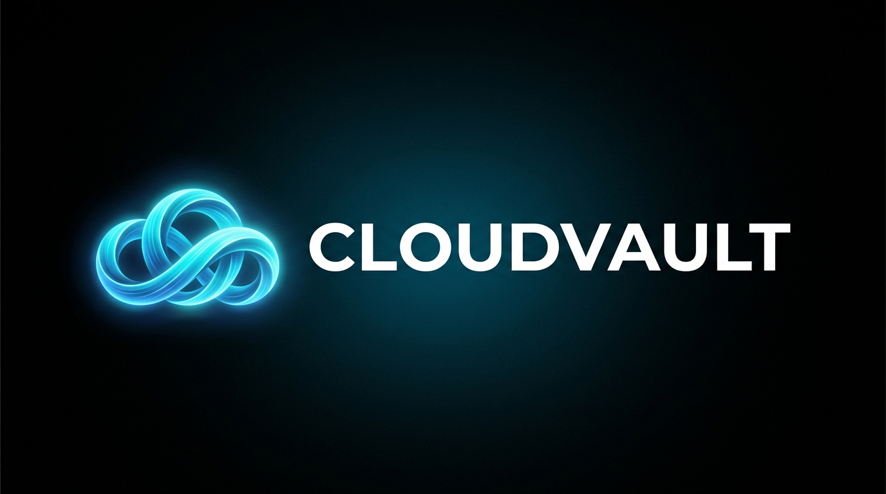

  

**Free, unlimited personal cloud storage for Android powered by Telegram.**

---

## Features

- **Instant Video Streaming** — Stream 4K and 1080p MKV/MP4 videos directly from Telegram Cloud using LibVLC with subtitle selection, multi-audio tracks, and split archive streaming.
- **In-App Document & PDF Reader** — Book-style horizontal page swiping (ViewPager2), pinch-to-zoom (up to 6x), orientation toggle, and page jump.
- **Background Audio Player** — Bottom mini-player, queue management, ID3 album artwork, and sleep timer.
- **Smart Media Gallery** — Timeline grid with Day, Month, and Year zoom modes plus fast scrolling.
- **Automatic Backup** — Real-time camera folder sync to private Telegram storage.
- **Duplicate Cleaner** — Checksum-based duplicate file scanner and one-tap remover.
- **9 Custom Themes** — Material You Monet dynamic theming, AMOLED Pure Black, Midnight Purple, Emerald Forest, Sunset Amber, Dracula Crimson, and Ocean Sapphire.
- **System Share Target** — Upload files directly to CloudVault from the native Android Share menu.

---

## Download & Install

Get the latest release APK from the [Releases](https://github.com/deepu2135/CloudVaultAndroid/releases/latest) page:

- **`CloudVault-v1.0.1-arm64-v8a.apk`** — **Recommended** for modern 64-bit Android smartphones and tablets (~75% smaller).
- **`CloudVault-v1.0.1-universal.apk`** — All-in-one build compatible with all devices.
- **`CloudVault-v1.0.1-armeabi-v7a.apk`** — Older 32-bit Android phones.
- **`CloudVault-v1.0.1-x86_64.apk`** — 64-bit Chromebooks and emulators.

---

## Quick Start

1. Install the APK matching your device architecture.
2. Log in with your phone number and verify via the official Telegram code.
3. Upload files or stream your cloud media instantly.

---

## Tech Stack

| Layer | Technology |
|---|---|
| Language | Kotlin (100%) |
| Cloud Engine | TDLib (Telegram Database Library) via JNI |
| Video Engine | LibVLC Android |
| Concurrency | Coroutines & StateFlow |
| UI Framework | Material Components & ViewPager2 |

---

## Privacy & Security

- **Direct Connection** — Connects directly to official Telegram servers via TDLib.
- **Zero Intermediaries** — No third-party servers, tracking, or telemetry.
- **Encrypted** — Inherits Telegram's MTProto cloud encryption.

---

## License

Distributed under the [MIT License](LICENSE).
